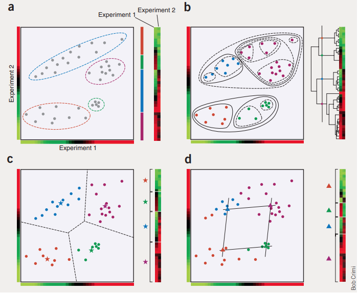

# CLUSTERIZAÇÃO DE EXPRESSÃO GÊNICA - PROJETO FINAL 3º IMERSÃO DADOS DA ALURA

**Introdução**

 Toda informação biológica dos seres vivos está armazenada em uma biomolécula chamada Ácido desoxirribonucleico ou simplesmente DNA. O conjunto de todo material genético presente dentro de cada célula de qualquer forma de vida, sejam bactérias, arqueas ou eucariotos, é denominado genoma. Nos organismos eucariotos, aqueles que possuem núcleo celular - estrutura que contém o genoma - e multicelulares, como nós humanos, todas as células possuem o genoma completo, com todas as características e "receitas" que ditam o que aquele ser vivo é, seu comportamento, suas estruturas histológicas e anatômicas e como se desenvolve.

Se todas as células do nosso corpo contêm todo o nosso genoma, como existem milhares de células altamente especializadas, com diferentes funções e estruturas totalmente divergentes espalhadas por aí? 

É nesse contexto que precisamos entender o conceito de expressão gênica e os mecanismos epigenéticos. A vida é algo extremamente complexo e tem um poder de organização incrível. Dependendo do tecido e função da célula, determinados genes são "ligados" ou "desligados" como se fossem interruptores, ou em termos técnicos, expressos ou não. A célula cardíaca sabe quais genes precisam ser expressos para que ela seja uma célula cardíaca, o mesmo acontece com os neurônios, células epiteliais, células que formam nossas mucosas, do nosso sangue e todas as outras que compõe nosso corpo. 

O termo expressão se refere ao processo de transcrição do DNA para outra molécula biológica chamada RNA e consequente tradução para uma proteína, de acordo com o código genético, os famosos códons - sequências de trincas de bases nitrogenadas, que explicarei logo o que são. Esse código é universal e todos os organismos vivos no planeta Terra o utilizam para formar suas proteínas. Muitas pessoas confundem o termo genoma com código genético.

REFERÊNCIA: O que é engenharia metabólica e como está transformando o mundo - Profissão Biotec <https://profissaobiotec.com.br/o-que-e-engenharia-metabolica-e-como-esta-transformando-o-mun/> Accessed: 2021-05-06

 O DNA que está sendo transcrito, ou expresso, é chamado de gene - ou em outras palavras, o pedacinho de DNA que vai gerar uma proteína com uma função no organismo, o resultado dessa transcrição é um tipo de RNA específico, o RNA mensageiro (RNAm). É o RNA que realiza todas as funções, de transcrever e traduzir o código presente no DNA em uma proteína, deixando o DNA com a função de um arquivo, onde a informação está escrita de acordo com um alfabeto de apenas 4 letras: A, T, C e G, que significam respectivamente: Adenina, Timina, Citosina e Guanina. Essas bases nitrogenadas são organizadas em pares - A com T e C com G. A ordem dos pares dessas unidades básicas da vida, dentro de cada gene, dita qual proteína será construída. Quase tudo nos sistemas biológicos funcionam com proteínas. A termos de curiosidade o genoma humano completo possui aproximadamente 3,2 bilhões de pares de bases. Em resumo, a expressão gênica se refere ao processo no qual um gene ou DNA codificante produz uma proteína.

A regulação da expressão gênica é algo extremamente importante para qualquer organismo vivo, pois modula os processos biológicos de acordo com eventos intracelulares e com o ambiente. Existem diversos mecanismos pelos quais os seres vivos controlam a expressão gênica, estudados a fundo no campo da epigenética (acima do gene) e que não serão discutidos aqui de forma aprofundada aqui.

Nosso objetivo neste projeto é mergulhar no universo da biologia e da biotecnologia e explorar uma base de dados da área. Utilizando uma base de dados disponibilizada pela Alura, baseada em uma competição do Kaggle, vamos tentar entender como esses dados estão organizados e utilizaremos um algorítmo de aprendizem não supervisionada para encontrar semelhanças entre os dados criando diferentes grupos.

O dicionário de dados está disponível no início do notebook, lá é explicado como os dados estão organizadas, quais são as variáveis e o que elas representam 

- Coloque o nome do projeto; (OK)
- Descreva o projeto; (OK)
- Apresente o objetivo do projeto; (OK)
- Evidencie as particularidades do projeto;
- Explique sobre a estrutura dos dados;
- Exiba os links utilizados para a conclusão do projeto

Links úteis:

- [Drug discovery: passado, presente e futuro](https://docs.google.com/document/d/10EhrQBChlyYIcff3to7PrCQi5HcNk2r-zd2ZCKPtcz8/edit?usp=sharing)
- [Expressão gênica: o caminho da informação biológica](https://docs.google.com/document/d/1TR-Q1cb2k_-S_MZC-60PMN2CbVGZbLMKT0Lr_didPY0/edit?usp=sharing)
- [How does gene expression clustering work? - NATURE](https://www.nature.com/articles/nbt1205-1499#:~:text=Clustering%20is%20often%20one%20of%20the%20first%20steps%20in%20gene%20expression%20analysis.&text=We%20can%20distill%20the%20data,is%20where%20clustering%20comes%20in.)

